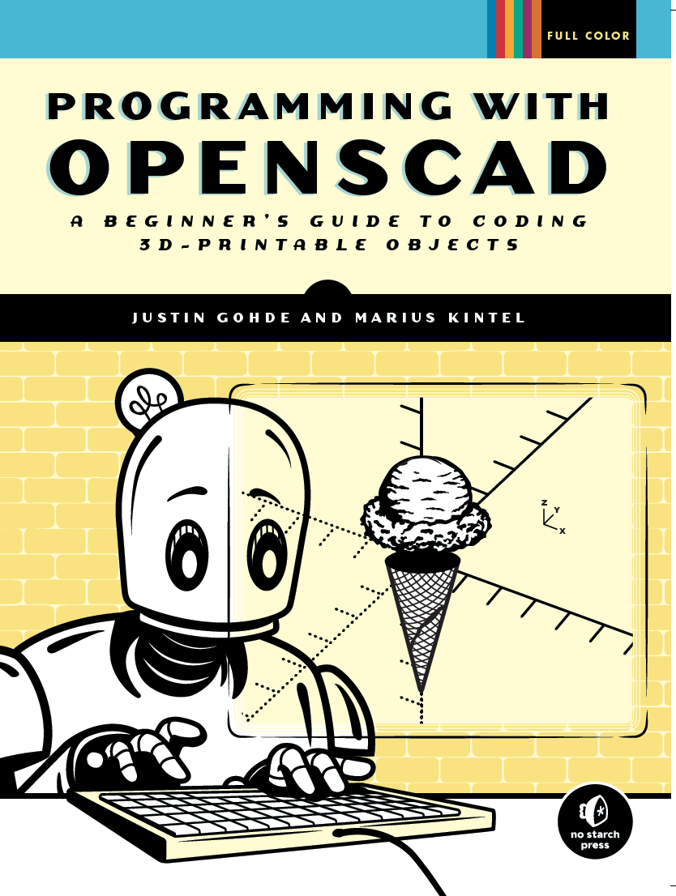
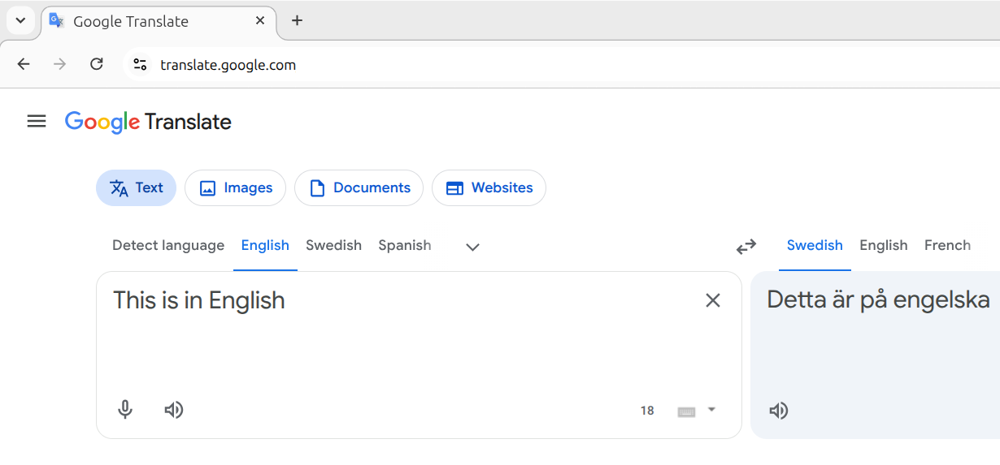
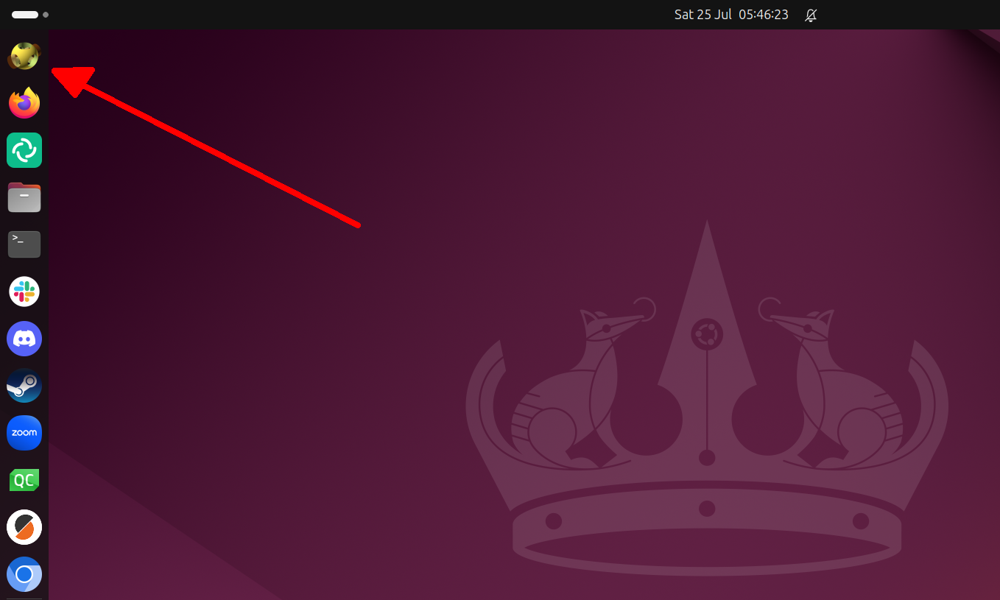
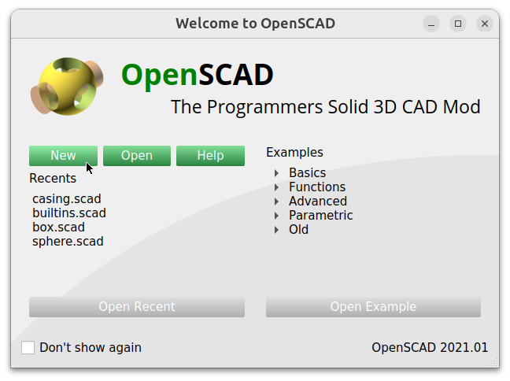
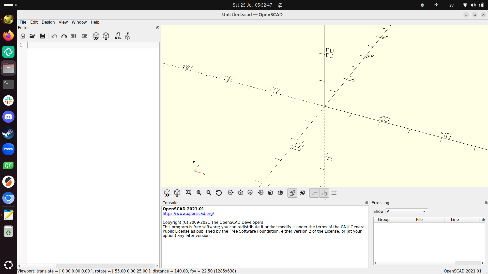
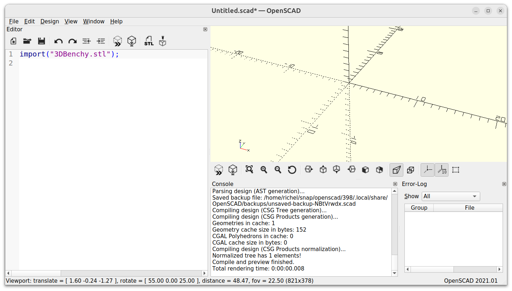

# 1. Introduktion och 3D ritning med OpenSCAD

I den här kapittel lära vis oss basen av
OpenSCAD. Vi följel kapittel 1 av boken
'Programming with OpenSCAD' av Justin Gohde
och Marius Kintel.



## 1.1. Att läsa Engelska

Boken är på Engelska.
Om du behöver översätta ord till svenska,
är Google Translate en bra webbsida:

I en webläsare (t.ex. Firefox, Chrome, Chromium, Edge, Opera)
surf till `https://translate.google.com` (det räcker
med att skriva `translate.google.com`).

Väljer den rätta språkor och dina meningar blir översätta:



## 1.2. Att öppna OpenSCAD

Om du använder våra kursdatorer,
kann du hitta OpenSCAD ikonen
på vänstrasida av skrivbordet:



Klicka på ikonen och OpenSCAD startar.

Om det finns ingen OpenSCAD ikon:

- Tryck på Windows tangenten


- Klicka på 'Type to search'

[Klicka på 'Type to search'](ubuntu_search.png)

- Skriv ner `openscad` och klick på OpenSCAD ikonen


## 1.3. Att start an ny ritning i OpenSCAD

Om du får den 'Welcome to OpenSCAD' föster,
klicka på 'New':



Nu kann du skapa 3D modeller i OpenSCAD:



## 1.3. Vad är OpenSCAD?

Av kapittel 'Introduction' i boken, läs början och paragraf
'What is OpenSCAD?', på sidorna `xv` (Romerska 15)  och `xvi` (Romerska 16).

Hur uttalar man 'OpenSCAD'?

### 1.3. Svar

På Engelska: 'Open-S-CAD', på svenska: 'åpen-äs-kät'.

## 1.4. Vad är 3D punktar?

Om du har aldrig hör om koordinater,
av kapittel 'Introduction' i boken,
läs hela paragrafen 'A brief introduction to 3D design with OpenSCAD',
på sidorna `xxii` (Romerska 22)  och `xviii` (Romerska 23).

1. Vilken koordinat har ursprunget ('origin')?
1. Hur uttalar man koordinatet av ursprunget ('origin')?
1. Varför har koordinater tre siffror?
1. Vilket koordinat har punkt P?
1. Hur läser man koordinatet P på svenska? Envänder ord som 'åt höger',
  'åt vänster', 'uppåt', neråt', usw.
1. Vilket koordinat är 5 vänster av P?

### 1.4. Svar

1. Koordinatet är `(0,0,0)`
1. Det är uttalat som 'noll komma noll komma noll'
1. För att 3D har tre rikningar: åt höger, åt djupet, och åt uppåt
1. Koordinatet av P är `(3,0,5)`
1. `(3,0,5)` uttalar man på svenska som: '3 åt höger, noll i djupet
  och 5 uppåt'.
1. Koordinatet 5 vänster av P är `(-2,0,5)`

## 1.5. Att rita en kub

Av kapittel 1 '3D drawing with OpenSCAD', läs sidor 1 till 3,
till (och inklusive) 'Drawing Cuboids with `cube`.
Kör koden i OpenSCAD.

1. Hur läser man på svenska `cube([5, 10, 20]);`?
1. Vad betyder den semicolonen (`;`)? Tips: vilken tecken använder människor
  i skift istället?
1. Vad betyder den hakparenteser (`[` och `]`)? Tips: vad heter stället där
  en av hörnar av kuben?
1. Ändra koden till `cube(5);`. Hur uttalar man på svenska vad koden gör?

### 1.5. Svar

1. På svenska läser man `cube([5, 10, 20]);` som: 'Kära dator,
  gjärna rita ut en kub som är 5 bredd, 10 djupt och 20 högt'
1. Den OpenSCAD semicolonen (`;`) är den svenka period (`.`) i skift
1. Hakparenteserna betyder att detta är ett koordinat. En av hörnarna av kuben
  har koordinatet `(5, 10, 20)`
1. På svenska uttalar man `cube(5);` som 'Kara dator, rita ut en kub med
  storlek 5'

## 1.6. Att rita sphärer

Läs sidor 3-4, 'Drawing Spheres with sphere'.

Kolla på första koden:

```c++
sphere(10);
```

Texten säger att den 10 är den 'radius' av sphären.

1. Vad är svenska översättning av engelska 'radius'?
1. Vad är detta?
1. En annat sätt att besrika storleken av en sphär är att använda
  ordet 'diameter'. Vad är detta?

## 1.6. Svar

1. Engelska 'radius' är 'radie' i svenska
1. Det är distansen mellan mitten av sphären och kanten
1. Diametern är distansen mellan ena sida till andra sida av sphären.

## 1.7. Att rita cilindrar och keglor

Läs sidor 4-6, 'Drawing
Cylinders and Cones with cylinder'.

Kolla på första koden:

```c++
cylinder(h=20, r1=5, r2=5);
```

1. Vilket Engelskt ord är `h` en förkortning av? Vad heter det på svenska?
1. Vilket Engelskt ord är `r` en förkortning av? Vad heter det på svenska?

### 1.7. Svar

1. `h` är en förkortnig av engelska 'height'. På svenska kaller i det 'höjd'.
1. `r` är en förkortnig av engelska 'radius'. På svenska kaller i det 'radie'.

## 1.8. ...

### 1.8. Svar

Så här ser det ut:



## 1.99. Slutuppgift

Rita varje figur på sida 22 'Design time: 3D shapes'
i samma ordning. Visa varje en till en lärare eller visar all 6 samtidigt.

