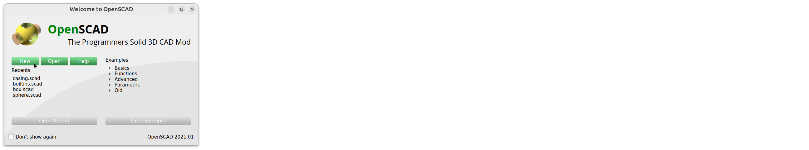
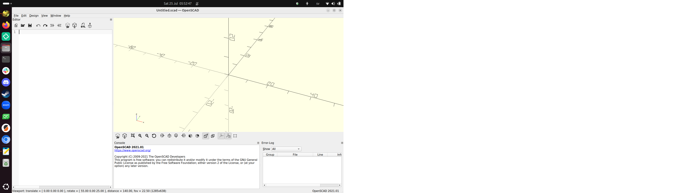
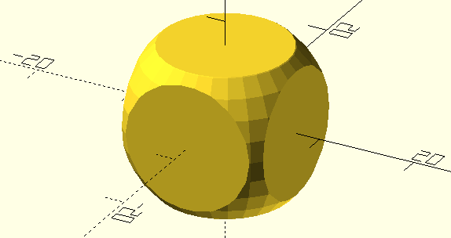
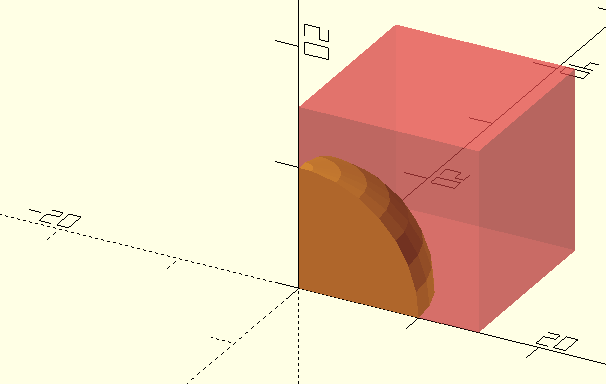

# 1. Introduktion och 3D ritning med OpenSCAD

I den här kapitel lära visa oss grunden av
OpenSCAD. Vi följel kapittel 1 av boken
'Programming with OpenSCAD' av Justin Gohde
och Marius Kintel.


\pagebreak

## 1.1. Att läsa Engelska

Boken är på Engelska.
Om du behöver översätta ord till svenska,
är Google Translate en bra webbsida:

I en webläsare (t.ex. Firefox, Chrome, Chromium, Edge, Opera)
surf till `https://translate.google.com` (det räcker
med att skriva `translate.google.com`).

Väljer den rätta språkor och dina meningar blir översätta:


\pagebreak

## 1.2. Att öppna OpenSCAD

Om du använder våra kursdatorer,
kann du hitta OpenSCAD ikonen
på vänstrasida av skrivbordet:


Klicka på ikonen och OpenSCAD startar.

\pagebreak

Om det finns ingen OpenSCAD ikon:

- Tryck på Windows tangenten


- Klicka på 'Type to search'

[Klicka på 'Type to search'](ubuntu_search.png)

- Skriv ner `openscad` och klick på OpenSCAD ikonen


\pagebreak

## 1.3. Att start an ny ritning i OpenSCAD

Om du får den 'Welcome to OpenSCAD' föster,
klicka på 'New':



Nu kann du skapa 3D modeller i OpenSCAD:



## 1.3. Vad är OpenSCAD?

Av kapittel 'Introduction' i boken, läs början och paragraf
'What is OpenSCAD?', på sidorna `xv` (Romerska 15)  och `xvi` (Romerska 16).

Hur uttalar man 'OpenSCAD'?

\pagebreak

### 1.3. Svar

På Engelska: 'Open-S-CAD', på svenska: 'åpen-äs-kät'.

## 1.4. Vad är 3D punktar?

Om du har aldrig hör om koordinater,
av kapittel 'Introduction' i boken,
läs hela paragrafen 'A brief introduction to 3D design with OpenSCAD',
på sidorna `xxii` (Romerska 22)  och `xviii` (Romerska 23).

1. Vilken koordinat har ursprunget ('origin')?
1. Hur uttalar man koordinatet av ursprunget ('origin')?
1. Varför har koordinater tre siffror?
1. Vilket koordinat har punkt P?
1. Hur läser man koordinatet P på svenska? Envänder ord som 'åt höger',
  'åt vänster', 'uppåt', neråt', usw.
1. Vilket koordinat är 5 vänster av P?

\pagebreak

### 1.4. Svar

1. Koordinatet är `(0,0,0)`
1. Det är uttalat som 'noll komma noll komma noll'
1. För att 3D har tre rikningar: åt höger, åt djupet, och åt uppåt
1. Koordinatet av P är `(3,0,5)`
1. `(3,0,5)` uttalar man på svenska som: '3 åt höger, noll i djupet
  och 5 uppåt'.
1. Koordinatet 5 vänster av P är `(-2,0,5)`

## 1.5. Att rita en kub

Av kapittel 1 '3D drawing with OpenSCAD', läs sidor 1 till 3,
till (och inklusive) 'Drawing Cuboids with `cube`.
Kör koden i OpenSCAD.

1. Hur läser man på svenska `cube([5, 10, 20]);`?
1. Vad betyder den semicolonen (`;`)? Tips: vilken tecken använder människor
  i skift istället?
1. Vad betyder den hakparenteser (`[` och `]`)? Tips: vad heter stället där
  en av hörnar av kuben?
1. Ändra koden till `cube(5);`. Hur uttalar man på svenska vad koden gör?

\pagebreak

### 1.5. Svar

1. På svenska läser man `cube([5, 10, 20]);` som: 'Kära dator,
  gjärna rita ut en kub som är 5 bredd, 10 djupt och 20 högt'
1. Den OpenSCAD semicolonen (`;`) är den svenka period (`.`) i skift
1. Hakparenteserna betyder att detta är ett koordinat. En av hörnarna av kuben
  har koordinatet `(5, 10, 20)`
1. På svenska uttalar man `cube(5);` som 'Kara dator, rita ut en kub med
  storlek 5'

## 1.6. Att rita sphärer

Läs sidor 3-4, 'Drawing Spheres with sphere'.

Kolla på första koden:

```c++
sphere(10);
```

Texten säger att den 10 är den 'radius' av sphären.

1. Vad är svenska översättning av engelska 'radius'?
1. Vad är detta?
1. En annat sätt att besrika storleken av en sphär är att använda
  ordet 'diameter'. Vad är detta?

\pagebreak

## 1.6. Svar

1. Engelska 'radius' är 'radie' i svenska
1. Det är distansen mellan mitten av sphären och kanten
1. Diametern är distansen mellan ena sida till andra sida av sphären.

## 1.7. Att rita cilindrar och keglor

Läs sidor 4-6, 'Drawing
Cylinders and Cones with cylinder'.

Kolla på första koden:

```c++
cylinder(h=20, r1=5, r2=5);
```

1. Vilket Engelskt ord är `h` en förkortning av? Vad heter det på svenska?
1. Vilket Engelskt ord är `r` en förkortning av? Vad heter det på svenska?

\pagebreak

### 1.7. Svar

1. `h` är en förkortnig av engelska 'height'. På svenska kaller i det 'höjd'.
1. `r` är en förkortnig av engelska 'radius'. På svenska kaller i det 'radie'.

## 1.8. Att importera

Läs sidor 6-7, 'Importing 3D Models with import'.

Kör koden på sida 6. Vad ser du? Varför?

\pagebreak

### 1.8. Svar

Koden visar ingenting! Så här ser det ut:


Det är på grund av att du inte har den filen (`3Dbenchy.stl`) du behöver.

## 1.9. Att flytta

Läs sidor 7-10, 'Modifying basic shapes'
till (och inklusive) 'Moving Shapes to a Specific Location with translate'.

Kolla på den här koden:

```c++
translate([1, 2, 3]) cube([4, 5, 6]);
```

1. En upprepning: hur läser man på svenska `cube([4, 5, 6])`?
1. Hur läser man på svenska `translate([1, 2, 3])`?
1. Ändra koden till `translate([1, 2, 3]); cube([4, 5, 6]);`.
  Vad händer? Varför?

\pagebreak

### 1.9. Svar

1. På svenska läser man `cube([4, 5, 6])` som: 'kära dator, rita ut
  en kub som är 4 bredd, 5 djupt och 6 högt'.
1. På svenska läser man `translate([1, 2, 3])` som: 'kära dator, flyttar
  saken efter den här kod med 1 till höger, 2 i djupet och 3 i höjden'.
1. Kuben blir ritat på den vanliga ställe (dvs. utan den `translate` kommand).
  Det är på grund av den semikolon (`;`) såklart: `translate([1, 2, 3]);`
  läser man på svenska som: 'kära dator, flyttar
  **ingenting** med 1 till höger, 2 i djupet och 3 i höjden'.
  Efter den fösta semikolonen blir bara den kub ritat som vanligt.

## 1.10. Smidiga kurvor

Läs sidor 11-12, 'Smoothing curves with `$fn`'.

Kolla på den här två kod:

```c++
// Kod 1
sphere(1, $fn = 50);
translate([2, 2, 2]) sphere(1);
```

```c++
// Kod 2
sphere(1);
translate([2, 2, 2]) sphere(1);
$fn = 50;
```

1. Hur kan man läsa `$fn = 50' på svenska?
1. Kör 'kod 1'. Blir den andra sphär ritat smidigt?
1. Kör 'kod 2'. Blir den andra sphär ritat smidigt?

\pagebreak

### 1.10. Svar

1. På svenska kan man läsa `$fn = 50' som 'kära dator, ritar ut alla
  kurvor med 50 linjer per cirkel'.
1. I kod 1 blir andra spheren inte ritat smidigt: den `$fn` blev
  bara användt för den första sphär.
1. I kod 2 blir andra spheren ritat smidigt: den `$fn`, även om
  den rad är efter all ritningar, blev gjort först! Båda sphärer
  är ritat smidiga.

## 1.11. Boolesk algebra

Läs sidor 12-13, 'Combining 3D Shapes with Boolean Operations',
inklusive tekstboxen ovanpå sida 13.

På svenska, hur skull du beskriva vad engelska 'boolean' är?

\pagebreak

### 1.11. Svar

En engelska 'boolean' är, i svenkt, en boolean.
En boolean är en typ av saker i världen som
kan vara sant eller falskt. Till example,
om du är född i sverige är sant eller falskt.

## 1.12. Felsökning

Läs sidor 13-15, 'Subtracting Shapes with difference',
till (och inklusive) 'Debugging difference Operations with #'.

1. Hur uttalar man `#` i svenska?
1. `#` viktigt för felsökning när man tar bort former. Varför är `#`
  inte viktigt när man **lägger till** former (som vi har hittils gjort)?

\pagebreak

### 1.12. Svar

1. `#` har mycket olika namn: nummertecken, brädgård, gärdsgård, stege,
  staket, spjälstaket, fyrkant, vedstapel, haga, stockhög, grind eller fyrtagg.
1. `#` är oviktigt när man lägger till former, för att man kan direkt ser
  den formen du har lagt till.
  
## 1.13. Glimmande väggar

Läs sidor 15-19, 'Avoiding "Shimmering Walls" with the `difference` Operation',
till (och inklusive) 'Grouping Shapes with `union`'.

Sven ville gör den här ritning:



Han har skrivit den här koden:

```c++
intersection() {
  cube(15);
  sphere(10);
}
```

1. Använder en nummertecken (`#`) för att visa felet. Vad är felet?
1. Hur kan Sven laga problemet?

\pagebreak

### 1.13. Svar

1. Om du lägger till en nummertecken före `cube`,
  ser du nedstående bild. Felet är at kuben är inte centrerade.



1. Gör kuben centrerade med `cube(15, center = true);` istället av
  bara `cube(15);`.

## 1.14. 3D skrivande

Läs sidor 19-20, 'Getting Ready for 3D Printing'.

1. Vad kallar man engelska 'rendering' i svenska? Vad betyder detta?

\pagebreak

### 1.14. Svar

1. Engelska 'rendering' är kallad 'rendering' på svenska också.

## 1.15. Slutuppgift

Rita varje figur på sida 22 'Design time: 3D shapes'
i samma ordning. Visa varje en till en lärare eller visar all 6 samtidigt.
